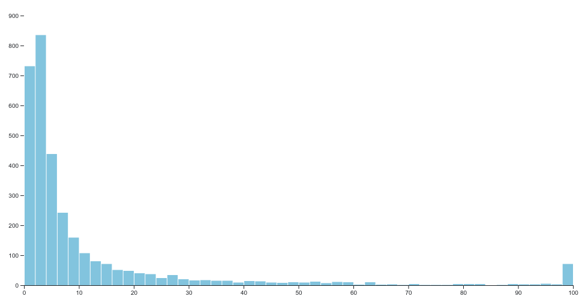
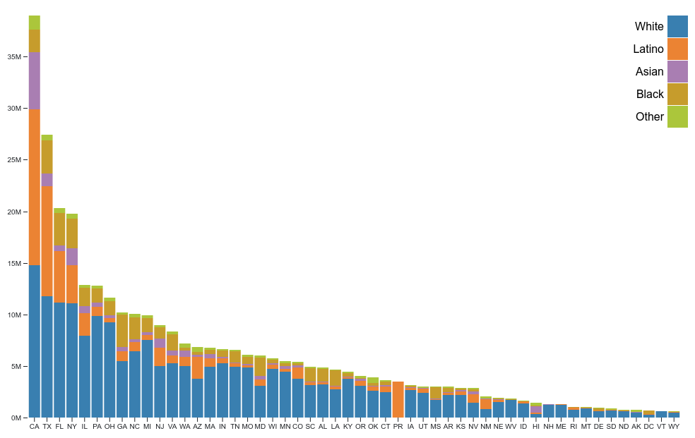
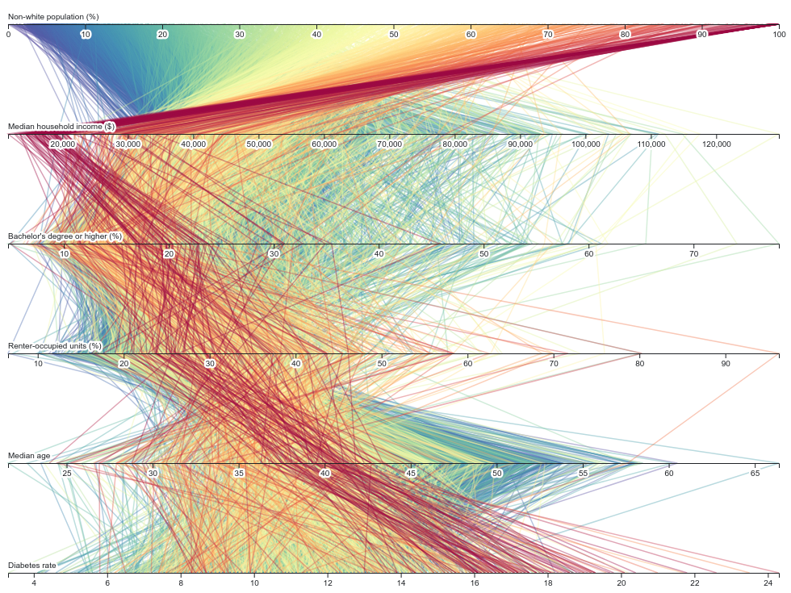

# census-data-downloader

Download Census data and reformat it for humans.

### Installation

```bash
$ pipenv install census-data-downloader
```

### Usage

Import our module.

```python
>>> import census_data_downloader
```

Download everything.

```
>>> census_data_downloader.download_everything("<YOUR CENSUS API KEY>", data_dir="./your-data-folder/")
```

That's it.

### Adding support for a new table

Subclass our downloader and provided it with its required inputs.

```python
import collections
from .base import BaseACSDownloader


class MedianHouseholdIncomeDownloader(BaseACSDownloader):
    PROCESSED_TABLE_NAME = "medianhouseholdincome"  # Your humanized table name
    RAW_TABLE_NAME = 'B19013'  # The id of the source table
    RAW_FIELD_CROSSWALK = collections.OrderedDict({
        # A crosswalk between the raw field name and our humanized field name.
        "001E": "median"
    })
```

Now you can import and run it yourself.

```python
>>> from yourmodule import MedianHouseholdIncomeDownloader
>>> obj = MedianHouseholdIncomeDownloader("<YOUR CENSUS API KEY>", data_dir="./your-data-folder/")
>>> obj.download_everything()
```

That's it. If you make some good ones, please consider submitting them as pull requests so everyone can benefit.

### Putting our data to use

All of the data files processed by this repository are published in the [processed data](./data/processed/) folder. They can be called in to applications via their raw URLs. Here are some examples created using [Observable](https://observablehq.com/collection/@datadesk/u-s-census-data).

Here's [county-level race data](https://github.com/datadesk/census-data-downloader/blob/master/data/processed/acs5_2017_race_counties.csv) in [a bivariate map](https://observablehq.com/@datadesk/black-and-latino-u-s-population-shares) of black and Latino populations.

[](https://observablehq.com/@datadesk/black-and-latino-u-s-population-shares)

Here's [a histogram](https://observablehq.com/@datadesk/black-and-latino-u-s-population-shares) of the percentage of Latinos in each U.S. county using the [same data file](https://github.com/datadesk/census-data-downloader/blob/master/data/processed/acs5_2017_race_counties.csv).

[](https://observablehq.com/@datadesk/black-and-latino-u-s-population-shares)

Now [a stacked bar](https://observablehq.com/@datadesk/racial-makeup-of-u-s-states-and-territories) using the [state-level version](https://github.com/datadesk/census-data-downloader/blob/master/data/processed/acs5_2017_race_states.csv) of the race dataset.

[](https://observablehq.com/@datadesk/racial-makeup-of-u-s-states-and-territories)

Lace a few different county-level datasets together and you can make [parallel coordinates charts](https://observablehq.com/@datadesk/the-demographics-and-destiny-of-all-3-220-u-s-counties) like this:

[](https://observablehq.com/@datadesk/the-demographics-and-destiny-of-all-3-220-u-s-counties)
